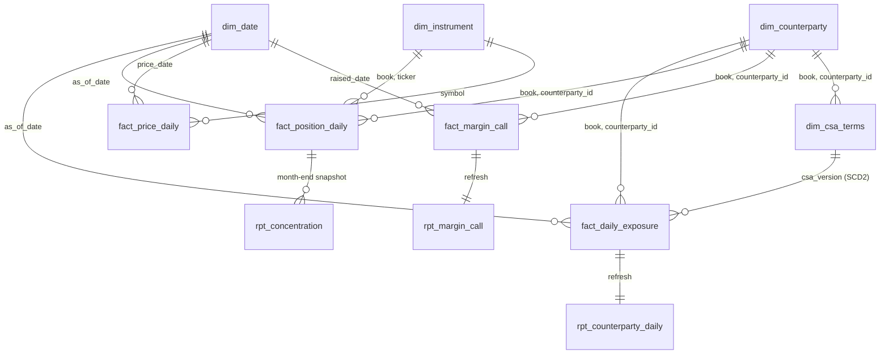

# MarginMaestro finance warehouse (BigQuery, Phase G7)

ADR: `docs/gcp/adr/0013-bigquery-analytics-warehouse.md` (amendment 2026-10-06). Jira: epic MM-94, stories MM-139 (dataset, schemas, governance), MM-140 (simulated-book backfill), MM-141 (live daily load), MM-142 (report tables, `/reports`, Tableau).

## What it is

A star schema in `marginmaestro-demo.marginmaestro_analytics` (us-central1) holding two books side by side:

| Book | What | Rows (approx.) |
|---|---|---|
| `live` | The app's own counterparties (CP-1..CP-8), loaded after every daily margin run | ~8 exposures, ~90 positions, a few calls per day |
| `historical-sim` | 1,000 **synthetic** counterparties, ~50,000 positions over the **real S&P 500** universe, five years (2021-08-02 .. 2026-07-31, 1,256 trading days) of **real** Yahoo Finance closes | ~63M position-days, 1.26M exposures, ~127k calls |

The simulated book exists only here: it never enters Cloud SQL and never reaches an LLM. Every number in both books comes from the deterministic calc engine (`calc/`), never from a model (CLAUDE.md golden rule 1).



| Table | Grain | Partition / cluster | Notes |
|---|---|---|---|
| `fact_daily_exposure` | counterparty x trading day | DAY(`as_of_date`) / counterparty_id, book | VM, IM, exposure, threshold (after rating triggers), MTA, collateral held, required support, headroom, call due, breached, call raised. `require_partition_filter` |
| `fact_position_daily` | position x trading day | DAY(`as_of_date`) / counterparty_id, ticker | quantity, close, market value. `require_partition_filter` |
| `fact_margin_call` | one row per call | DAY(`raised_date`) / counterparty_id, book | trigger, amount, code-generated rationale, raised / approved / manager / notified / acknowledged / escalated timestamps, SLA outcome, channel |
| `fact_price_daily` | symbol x trading day | DAY(`price_date`) / symbol | closes (Yahoo Finance) and FRED rates when a key is configured |
| `dim_counterparty` | counterparty | RANGE(`book_key`) | names, type, country, tier, current rating |
| `dim_instrument` | ticker per book | RANGE(`book_key`) | asset class, GICS sector / sub-industry from the S&P 500 snapshot |
| `dim_csa_terms` | CSA version (SCD2) | RANGE(`book_key`) | threshold, MTA, trigger, haircuts, `valid_from` / `valid_to` / `is_current` |
| `dim_date` | day 2021..2030 | none | the shared calendar (the one table without `book`) |
| `rpt_counterparty_daily` | counterparty x day | DAY / book, counterparty_id | reports 1, 2, 5 |
| `rpt_concentration` | position at month-end | MONTH(`month_start`) / book, counterparty_id, sector | report 3 |
| `rpt_margin_call` | call | MONTH(`raised_date`) / book, counterparty_id | report 4 |

`src/warehouse/schemas.py` is the single source of truth for every schema. Terraform reads the JSON it renders (`infra/gcp/bigquery_schemas/`), the loaders write columns in its order, and `docs/data_catalog.yaml` (`warehouse_tables`) classifies every column; unit tests fail if any of the three drift.

## Sizes (measured)

Measured locally from the real data (`python -m warehouse.backfill --all --dry-run`, laptop, Windows, Python 3.11). Logical bytes use BigQuery's sizing (STRING = 2 + UTF-8 length, numbers / dates 8, BOOL 1, NULL 0).

| Table | Rows | Logical bytes/row | Logical size |
|---|---:|---:|---:|
| `fact_position_daily` | 62.4M | 86 | 5.4 GB |
| `fact_daily_exposure` | 1.255M | 133 | 167 MB |
| `fact_margin_call` | 127k | 338 | 43 MB |
| `fact_price_daily` | 625k | 54 | 34 MB |
| report tables (after refresh) | ~5M | 60-110 | ~0.4 GB |
| **Total** | | | **~6 GB** (free tier: 10 GiB) |

See "Measured run" at the end of this file for the full dry-run output and timings.

## Cost guardrails ($0 target)

- **Storage** ~6 GB logical, inside the 10 GiB/month free tier. Logical billing, so the time-travel copies a partition replace leaves behind are not billed; `max_time_travel_hours = 48`.
- **Loads** are batch load jobs from local gzip CSV (free). No streaming inserts exist in the code (`warehouse.client` has no such method), no GCS staging.
- **Replacing data** = `DELETE ... WHERE <partition column> BETWEEN ...` covering whole partitions (BigQuery drops them without scanning: 0 bytes) + `WRITE_APPEND` load. The DELETE is still capped at 50 MB.
- **Every query** sets `maximum_bytes_billed` (`WarehouseClient.query` requires it, ceiling 8 GB). The report refresh scripts and report queries state their scan in a header comment:
  - backfill, once: ~4 GB for the concentration snapshots + ~150 MB for the daily report table;
  - live daily load: a few MB;
  - a `/reports` page view: 5-6 queries over `rpt_*` only, each <= ~75 MB, cached 10 minutes per (report, book, period, scope).
  All of it is far inside the 1 TiB/month free query tier.
- **Partitioning + clustering** on every large table; `require_partition_filter` on the two big facts, so an unfiltered query fails instead of scanning 5 GB.
- **Policy tags, masking and row access policies** cost nothing.
- **Paid option (off):** `var.warehouse_load_job = true` adds a dedicated 17:15 New York Cloud Scheduler job: $0.10/month (three jobs are free per billing account and all three are used). By default the daily margin run triggers the load itself.

## The simulated book

- **Universe:** the current S&P 500 constituents from Wikipedia, committed as `src/warehouse/data/sp500_constituents.csv` with its source URL and fetch date (`python -m warehouse.sp500 --refresh` re-snapshots it).
- **Prices:** Yahoo Finance daily `Close` (split-adjusted, not dividend-adjusted), downloaded in batches of 100 with retries and cached under `data/warehouse_cache/` (git-ignored). VIX is `^VIX` — the same CBOE close FRED publishes as `VIXCLS`, which the live app's IM uses. FRED rates are added to `fact_price_daily` when `FRED_API_KEY` is set and skipped otherwise.
- **Counterparties** (`warehouse.simulated_book`, seeded): names `SIM <word> <suffix> <nnnn>` (clearly synthetic); type, jurisdiction and the elite share follow the live seed; ratings drawn per type and migrated one notch at quarterly reviews; CSA thresholds drawn by rating around the eight seeded CSAs (USD 90k-450k), MTAs USD 10k-50k, rating triggers to 0 below B (or BBB), haircuts as in the seeded CSAs; 30% of CSAs renegotiated at each annual review (new SCD2 version).
- **Positions:** 35-65 per counterparty, notional USD 20k-250k (log-uniform; elite x1.5), 75% long, quantity = notional / the ticker's first close in the window.

### Simplifications (stated, not hidden)

- **Survivorship bias.** The universe is today's S&P 500, back-tested over five years: companies that left the index (acquired, delisted, failed) are missing, and companies added later are held before they joined. Returns and drawdowns are flattered accordingly.
- **Static books.** Positions don't trade over the five years. A position in a ticker listed later starts on its second priced day (VM needs a prior close). Isolated missing closes (halts) are forward-filled up to 5 days.
- **Settlement.** A call is settled in cash the next trading day; when the client misses the SLA (3% elite, 7% standard) the call is escalated and settles a day later. While a call is open no second call is raised (ADR-0020's daily-run rule; the intraday materiality gate doesn't apply to end-of-day closes).
- **Returns.** At each month end, collateral above the required support is returned when the excess clears the MTA (the CSA Return Amount). The live app leaves returns out of scope; without them collateral would only ratchet up over five years.
- **Opening collateral** is 0.9-1.2x the first day's required support (floor USD 10,000, as in the live calibration).
- **Lifecycle times** in the simulated book (approval 4-40 min, manager 5-30 min, acknowledgement 5-55 min, SLA 60 min) are drawn, not observed; approvers are `sim-approver-n`. Every row says `book = 'historical-sim'`.

### Correctness of the vectorized backfill

The backfill runs 1,000 counterparties per day as numpy arrays (`warehouse.vector_calc`). Each function reuses `calc/`'s constants and helpers (`risk_weight`, `vix_multiplier`, `RATING_ORDER`) and keeps its arithmetic order; `tests/unit/test_warehouse_vector_calc.py` checks VM, IM, effective threshold and breach against the scalar `calc/` functions on 25 randomized books each, and `tests/unit/test_warehouse_backfill.py` asserts exact numbers on a 3-ticker, 5-counterparty, 10-day fixture worked out by hand (rating trigger, renegotiation, settlement, open-call blocking, escalation, month-end return, late listing).

## Running the backfill

Prerequisites: your Google account in `var.warehouse_loaders` (dataEditor, jobUser, `TRUE` row policy, unmasked read), Application Default Credentials (`gcloud auth application-default login`), the Terraform applied.

```bash
# from the repo root, with the project's virtualenv
export PYTHONPATH=src GCP_PROJECT_ID=marginmaestro-demo
python -m warehouse.backfill --list                     # 21 quarter chunks, 2021-Q3 .. 2026-Q3
python -m warehouse.backfill --chunk 2024-Q1 --dry-run  # compute + size one chunk, load nothing
python -m warehouse.backfill --dims                     # dimensions + calendar
python -m warehouse.backfill --chunk 2021-Q3            # one chunk (idempotent)
python -m warehouse.backfill --all                      # dims + every chunk
```

- The first run downloads ~500 tickers (about 40 s) into the cache; later runs read it.
- Each run simulates the whole five-year path (collateral is path-dependent; ~10 s) and writes only the requested chunks, streaming one day at a time to gzip CSV in the temp directory: memory stays flat (< 1 GB).
- Re-running a chunk replaces exactly that chunk. A failed run can simply be re-run.
- No path, table or dataset comes from the command line; the chunk is validated against the fixed list.

## Live daily load

`POST /internal/warehouse/daily-load[?as_of=YYYY-MM-DD]` (internal OIDC caller only) loads the live book's day: exposure recomputed with `calc/` from Cloud SQL (official closes in `price_history`, `VIXCLS`, collateral, ratings, and the CSA terms the orchestrator last extracted — no LLM call), the positions snapshot, that day's prices and rates, every call raised in the trailing 14 days with its lifecycle so far (from the audit trail), and the live dimensions (CSA terms as SCD2 versions of what the orchestrator extracted). It then refreshes the report tables for that window. `as_of` defaults to the latest day with official closes. With `WAREHOUSE=bigquery` the daily margin run calls the same load at its end (best effort: a warehouse failure is logged and never fails the run).

## Access

| Who | Rows | Confidential columns |
|---|---|---|
| mm-api-sa, `warehouse_loaders` | all (`TRUE` policy) | unmasked |
| `warehouse_readers` (firm-wide, e.g. the Tableau account) | all | masked (0 / empty) unless also in `warehouse_unmasked_readers` |
| `warehouse_scoped_readers` (member -> CP ids) | `book = 'live'` and their counterparties only | masked |
| anyone else | none | — |

In the app, `/reports` applies the caller's Cloud SQL RLS scope: firm-wide roles see both books; analysts see only their live counterparties, and the simulated book returns 403 (it is a firm-wide back-testing book with no analyst coverage).

## Measured run

`python -m warehouse.backfill --all --dry-run` on 2026-10-06 (real data, cache warm, no FRED key; Windows laptop):

| Table | Rows | Logical | gzip CSV (upload) |
|---|---:|---:|---:|
| `fact_position_daily` | 62,384,094 | 5,377 MB (86 B/row) | 1,659 MB |
| `fact_daily_exposure` | 1,255,000 | 167 MB (133 B/row) | 84 MB |
| `fact_margin_call` | 127,258 | 43 MB (338 B/row) | 10 MB |
| `fact_price_daily` | 624,687 | 34 MB (54 B/row) | 6 MB |
| dimensions + calendar | 7,497 | 0.6 MB | -- |

- Book: 1,000 counterparties, 50,318 positions, 503 tickers, 1,265 price days (1,255 in the window).
- Compute + write: **330 s** for all 21 chunks (~130-250k rows/s, ~16 s per quarter). Inputs from cache: 4 s; first download ~40 s.
- A real run adds the uploads (~1.76 GB gzip in total, ~85 MB per quarter) and 7 BigQuery jobs per chunk (4 loads + 3 refresh scripts); at 20 Mbit/s upload that is ~12 minutes of transfer, so plan **~20-30 minutes** for `--all`.
